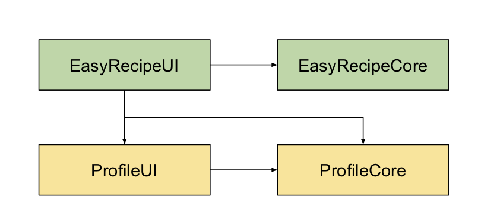
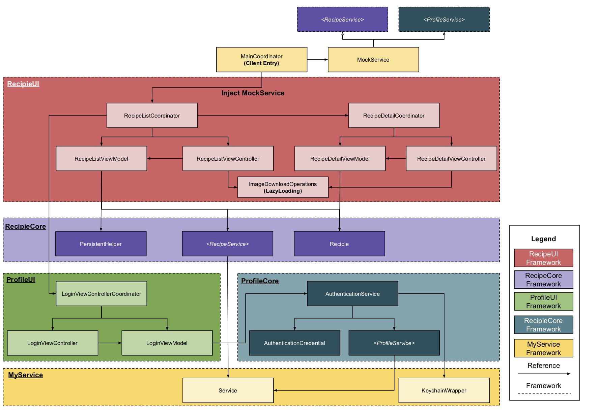

# App Coding Challenge - Easy Recipe
[](https://github.com/chronicqazxc/EasyRecipe)        

# Desclamier
All the recipes are mock data include the nutrition and ingredients.
## Components
1. EasyRecipeUI: Represent the human readable data and the layout. 
2. EasyRecipeCore: Get the recipe data and generate the data model.
3. ProfileUI: Provide user login view.
4. ProfileCore: In charge of user login logic.   
## Technics   
1. Profile Login ​
2. Core Data ​
3. Keychain ​
4. Recipe Favorite/unfavorite ​
5. Recipe Rated/unrated (rating range: 1 to 4 stars) ​
6. MVVMC ​
7. Fluid layout ​

## Dependencies Diagram


## HighLevel Architecture


## Line of code
```
find . \( -path ./Carthage -o -path ./EasyRecipeDemo.xcodeproj -o -path ./EasyRecipeDemo -o -path ./Tests -o -path ./build -o -path ./docs \) -prune -o -type f -exec wc -l {} + | sort -n
```

## Demo Introduction
The demo consist with two part.
1. Login view demo:
Test the user login feature.
2. EasyRecipe demo:
The main part of the demo, entry of the EasyRecipe including user login feature. 

## Dependencies
All the dependencies in this demo app are my private projects.
1. **[chronicqazxc/WHCoreServices](https://github.com/chronicqazxc/WHCoreServices)**:
2. **[chronicqazxc/WHUIComponent](https://github.com/chronicqazxc/WHUIComponent)**:

## Example

This demo was build in Xocde Version 11.0 (11A420a) with Swift 5.0
To run the demo project,
clone the repo and run `carthage update --platform ios` from the project root directory.

## Requirement

- iOS 13.0+

## Author

- [Wayne Hsiao](mailto://chronicqazxc@gmail.com)
- <a href="https://wayne-blog.herokuapp.com" target="_blank">Wayne Hsiao's blog</a>
- [Wayne Hsiao's GitHub](https://github.com/chronicqazxc)

## License

ConfettiView is available under the MIT license.
See the LICENSE file for more information.
